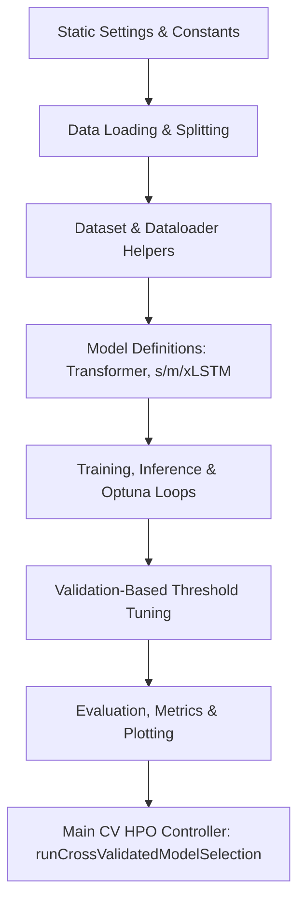

# ECG5000 Classification Pipeline Analysis & Reorganization Plan

This document provides a detailed analysis of the `helpers.py` file within the `xLSTMandEncoderHPO` directory. It explains its current functionality, discusses the robustness of the Hyperparameter Optimization (HPO) and Cross-Validation (CV) setup, explains how oversampling and data augmentation affect other tunings, analyzes the precision-recall threshold adaptation, and proposes a plan to improve the project's overall structure.

---

## Part 1: Comprehensive Breakdown of `helpers.py`

`helpers.py` acts as a monolithic engine for the entire repository. It encapsulates model architectures, dataset loading, standard training/inference routines, metric reporting, plotting, and the Optuna hyperparameter optimization + cross-validation runner. 

Here is the block-by-block breakdown of the file:



### 1. Static Configuration & Constants (Lines 42–96)
- Declares hyperparameters, early stopping settings, paths, seeds, and execution threads.
- **`MODEL_TYPE = "transformer"`** acts as a global toggle to run the entire script either for the Transformer Encoder or the xLSTM architectures.
- Defines settings like `TEST_FRACTION = 0.60`, which holds out 60% of the data for final test evaluation, leaving 40% for HPO and CV.

### 2. Dataset & Data Loading Utilities (Lines 99–138, 663–689)
- **[`ClassificationDataset`](file:///c:/Users/cbyll/Monica/TUB/ecg5000_time_series_modelling/src/xLSTMandEncoderHPO/helpers.py#L99-L117)**: A basic PyTorch `Dataset` that wraps ECG signals and integer labels.
- **[`PositionalEncoding`](file:///c:/Users/cbyll/Monica/TUB/ecg5000_time_series_modelling/src/xLSTMandEncoderHPO/helpers.py#L119-L138)**: Implements standard sinusoidal positional encoding to inject temporal ordering into the Transformer.
- **`loadRawDataFromFile`** & **`loadTaskData`**: Standardizes loading from the `ECG5000` text files, combining train/test splits, and mapping labels for either a **binary** task (Normal vs. Abnormal) or a **multiclass** task (classifying between the 4 abnormal heartbeat types).

### 3. Model Architectures (Lines 140–374, 865–960)
- **[`BaseTransformerClassifier`](file:///c:/Users/cbyll/Monica/TUB/ecg5000_time_series_modelling/src/xLSTMandEncoderHPO/helpers.py#L141-L181)**: A standard Transformer Encoder model with input projection, positional embedding, transformer encoder layers, and a flattened fully-connected projection head.
- **xLSTM Variants**:
  - `MLSTMClassifier` (mLSTM blocks with matrix memory).
  - `SLSTMClassifier` (sLSTM blocks with scalar memory, stabilizer, and vanilla PyTorch backend).
  - `XLSTMClassifier` (Mixed block stack featuring mLSTM and sLSTM blocks).
  - `chooseTypeLSTM`: Factory function returning one of the three baseline xLSTM variants.
- **[`TunableXLSTMClassifier`](file:///c:/Users/cbyll/Monica/TUB/ecg5000_time_series_modelling/src/xLSTMandEncoderHPO/helpers.py#L865-L960)**: A consolidated version of the xLSTM architectures designed for Optuna. It dynamically instantiates different combinations of mLSTM, sLSTM, or mixed block stacks, and supports multiple pooling mechanisms (`"last"`, `"mean"`, `"flatten"`) before the classification head.

### 4. Loss & Dataloader Builders (Lines 376–425, 1082–1108)
- **`getCriterion`**: Computes balanced class weights on the training labels to handle class imbalance, returning a weighted `nn.CrossEntropyLoss`.
- **`getLoaders`** & **`getLoadersOptuna`**: Converts scaled arrays into Dataloaders. `getLoadersOptuna` allows the batch size to be passed as a variable (so Optuna can search over it) and uses a larger `EVAL_BATCH_SIZE` for validation and test.

### 5. Training, Validation & Inference Loops (Lines 427–583, 1110–1243)
- **`performTrainingLoop`**: Standard Pytorch training loop with checkpoint saving and early stopping.
- **`performInferenceLoop`** & **`performTestingLoop`**: Forward-only validation/testing loops returning logits and target labels.
- **`performTrainingLoopOptuna`**: Custom training loop designed for HPO. It:
  - Uses `AdamW` instead of `Adam` to handle weight decay correctly.
  - Integrates progress bars via `tqdm`.
  - Integrates with Optuna's pruning framework (`trial.report` and `trial.should_prune`) to terminate unpromising trials early.

### 6. Optuna Setup & Search Spaces (Lines 962–1080)
- **`suggestXLSTMHyperparams`** & **`suggestTransformerHyperparams`**: Define the search spaces for both model types. Categorical variables are structured to guarantee mathematical consistency (e.g., ensuring `n_heads` divides `d_model` in multi-head attention).
- **`buildModel`**: Factory function that acts as a single initialization entry point for both model architectures based on the parameter dictionary generated by Optuna.

### 7. Decision Threshold Selection (Lines 585–661)
- **`chooseThresholdMaxFbeta`**: Finds the threshold on the validation set that maximizes the $F_\beta$ score for binary outcomes.
- **`chooseMulticlassThresholds`**: Computes one-vs-rest thresholds per class using validation set scores.
- **`applyMulticlassThresholds`**: Implements custom inference decision logic. It computes the margin ($p_c - \text{threshold}_c$) for each class; the class with the largest positive margin is selected. If no class clears its threshold, it falls back to standard argmax.

### 8. Orchestrator: runCrossValidatedModelSelection (Lines 1310–1483)
- Coordinates the entire experimental setup:
  1. Splitting data: Splits the dataset into a **Development Pool (40%)** and a **Held-out Test Set (60%)**.
  2. Cross-Validation: Sets up a 5-fold Stratified K-Fold cross-validation on the development pool.
  3. HPO Execution: Runs Optuna to minimize the mean validation loss across the folds.
  4. Final Refit: Splits the development pool into an 80/20 train/validation split. Trains a fresh model with the best parameters on the training split, using the validation split for early stopping.
  5. Threshold Tuning: Computes decision thresholds on the validation split's predictions.
  6. Final Evaluation: Evaluates the model on the held-out test set using the tuned thresholds, printing metrics and plotting evaluation curves.

---

## Part 2: Code Organization & Project Reorganization

Having all these layers of code inside a single file (`helpers.py`) violates the Single Responsibility Principle. To make the project maintainable, clean, and easily extensible, we should modularize it.

### Proposed Directory Layout

Here is a recommended layout under `src/`:

```
ecg5000_time_series_modelling/
│
├── src/
│   └── xLSTMandEncoderHPO/
│       ├── __init__.py
│       │
│       ├── models/                  # PyTorch model architectures
│       │   ├── __init__.py
│       │   ├── transformer.py       # BaseTransformerClassifier, PositionalEncoding
│       │   └── xlstm.py             # MLSTM, SLSTM, XLSTM, TunableXLSTM
│       │
│       ├── data/                    # Datasets, loading, preprocessing
│       │   ├── __init__.py
│       │   ├── dataset.py           # ClassificationDataset
│       │   ├── preprocessing.py     # Scaling, oversampling, data augmentation
│       │   └── loaders.py           # loadTaskData, getLoadersOptuna, makeFolds
│       │
│       ├── engine/                  # Training and validation logic
│       │   ├── __init__.py
│       │   ├── trainer.py           # performTrainingLoopOptuna, performTrainingLoop
│       │   └── evaluator.py         # performInferenceLoop, performTestingLoop
│       │
│       ├── metrics/                 # Decision thresholds & plotting
│       │   ├── __init__.py
│       │   ├── thresholds.py        # chooseThresholdMaxFbeta, chooseMulticlassThresholds, applyMulticlassThresholds
│       │   └── plots.py             # plotLossCurve, performMetrics
│       │
│       ├── hpo/                     # HPO & Cross-Validation orchestrator
│       │   ├── __init__.py
│       │   ├── search_spaces.py     # suggestHyperparams, resolveBestParams
│       │   └── orchestrator.py      # runCrossValidatedModelSelection
│       │
│       ├── abnormal_multiclassifer_optuna.py
│       ├── normal_abnormal_binary_classifier_optuna.py
│       └── runner_optuna.py
```

### Function & Class Mapping Matrix

Use this table to migrate functions out of `helpers.py` into their new modular locations:

| Original Function / Class | New Modular Destination File | Responsibility |
| :--- | :--- | :--- |
| `ClassificationDataset` | `data/dataset.py` | PyTorch Dataset wrapper |
| `PositionalEncoding` | `models/transformer.py` | Sinusoidal positional embeddings |
| `BaseTransformerClassifier` | `models/transformer.py` | Transformer Encoder model definition |
| `MLSTM-`, `SLSTM-`, `XLSTMClassifier` | `models/xlstm.py` | Basic xLSTM model variants |
| `TunableXLSTMClassifier` | `models/xlstm.py` | Dynamic xLSTM wrapper for Optuna |
| `chooseTypeLSTM` | `models/xlstm.py` | Factory function for baseline xLSTMs |
| `loadRawDataFromFile`, `loadTaskData` | `data/loaders.py` | Loading and initial processing |
| `makeFolds`, `_loader` | `data/loaders.py` | CV splits and basic loader instantiation |
| `getLoaders`, `getLoadersOptuna` | `data/loaders.py` | Loader builders for standard and HPO pipelines |
| `performTrainingLoop`, `performTrainingLoopOptuna` | `engine/trainer.py` | PyTorch loops backpropagating gradients |
| `performInferenceLoop`, `performTestingLoop` | `engine/evaluator.py` | Logit extraction and argmax validation loops |
| `chooseThresholdMaxFbeta`, `chooseMulticlassThresholds` | `metrics/thresholds.py` | Validation threshold tuning logic |
| `applyMulticlassThresholds` | `metrics/thresholds.py` | Threshold inference decision-making |
| `plotLossCurve` | `metrics/plots.py` | Visualizing train/val training history |
| `performMetrics` | `metrics/plots.py` | Prints final scores, saves CM and ROC/PR plots |
| `suggestXLSTMHyperparams`, `suggestTransformer-` | `hpo/search_spaces.py` | Defines search boundaries for parameters |
| `suggestHyperparams`, `resolveBestParams` | `hpo/search_spaces.py` | Maps active configurations |
| `buildModel` | `models/xlstm.py` (or `hpo/`) | Common factory for model creation |
| `crossValidatedScore` | `hpo/orchestrator.py` | Multi-fold CV training loop for single HPO trials |
| `runCrossValidatedModelSelection` | `hpo/orchestrator.py` | Main controller running HPO and evaluating test set |

### Recommended Code-Quality Enhancements
1. **Config Management**: Replace the uppercase global constants at the top of the file (e.g., `BATCH_SIZE`, `LR`, `EPOCHS`) with an external configurations file (like a `.yaml` file) or a python `dataclass` configuration system. This prevents hardcoding and makes it easier to track configurations.
2. **Device Parameterization**: Centralize `device` selection. Currently, functions like `chooseTypeLSTM` expect a `device` parameter, while others default to `device` declarations. 
3. **Structured Checkpoints**: Instead of dumping checkpoints (`best_model.pth`) and figures directly into the workspace root directory, structure outputs into `./checkpoints/` and `./plots/` folders.

---

## Part 3: Cross-Validation & HPO Pipeline Analysis

The current pipeline layout is highly robust and adheres to machine learning best practices:

```
[Full Dataset]
      │
      ├─► Held-out Test Set (60%) ──(Only used for final metrics evaluation)
      │
      └─► Development Pool (40%)
                │
                ├─► Optuna HPO via 5-Fold Stratified CV
                │      ├─► Train on 4 Folds (Oversampled)
                │      └─► Validate on 1 Fold (Natural distribution)
                │
                └─► Final Refit
                       ├─► Train on 80% of Dev Pool (Oversampled)
                       ├─► Early Stop / Tune Thresholds on 20% of Dev Pool (Natural)
                       └─► Test on 60% Held-out Test Set
```

### Analysis of the CV Evaluation Flow
1. **Stratification**: Using `StratifiedKFold` ensures that the severe class imbalances are proportionally preserved in both the training and validation folds. This is critical for ECG datasets where certain abnormal heartbeats are rare.
2. **Held-out Test Separation**: Holding out 60% of the dataset prior to hyperparameter optimization is a reliable way to avoid selection bias (overfitting to the validation sets).
3. **Double Training Setup**:
   - During **HPO**, the search uses a lower epoch budget (`HPO_EPOCHS = 40`) and K-Fold CV.
   - During the **Final Refit**, the best hyperparameters are trained over the full budget (`EPOCHS = 300`) with early stopping.

### Opportunities for Improvement
- **Final Refit Training Data**: In the final step, the code splits the development pool into 80% training and 20% validation. This means the model is final-trained on only 32% ($80\% \times 40\%$) of the overall dataset. 
- **Recommendation (Ensemble Voting)**: Instead of doing a single final refit on a sub-split, you can keep the 5 models trained during the best CV trial (or retrained on the 5 folds over the full epoch budget). At test time, you average their soft probabilities (logits) or perform majority voting. This uses 100% of the development pool data for inference, reduces variance, and leads to more robust classifications.

---

## Part 4: Oversampling and Data Augmentation

You mentioned using oversampling (`RandomOverSampler`) and want to know how it and data augmentation affect other tunings.

### 1. Oversampling vs. Loss Weighting
In the code:
- **`crossValidatedScore`** and the final **`runCrossValidatedModelSelection`** call `RandomOverSampler` on the training fold/split, balancing the class distribution.
- They then use `nn.CrossEntropyLoss()` **without** class weights. This is correct!
- **Warning**: If you apply *both* oversampling (which duplicates minority class samples) and class weighting (which scales up the loss for minority classes), you will over-correct for the class imbalance. This can cause the model to overfit heavily to the minority class samples, leading to high false-positive rates.

### 2. The Golden Rule of Data Preprocessing
> [!IMPORTANT]
> Both **Oversampling** and **Data Augmentation** must **ONLY** be applied to the **training folds/splits**. 
> The validation folds and the final test set must keep their natural class distributions and unmodified signals. If you augment/oversample before splitting or apply it to validation data, you leak information, leading to overly optimistic results that will fail in production.

### 3. How Data Augmentation Impacts Other Hyperparameters
If you add data augmentation to your ECG signals (e.g., adding Gaussian noise, random scaling, baseline drift, time-warping, or cropping), it changes the dynamics of model training in several ways:

1. **Regularization Trade-off**:
   Data augmentation acts as a strong visual/temporal regularizer. If you introduce significant augmentation, you should search for lower values of other regularizers (such as `dropout` and `weight_decay` in your Optuna search space) to prevent the model from underfitting.
2. **Epoch Budget**:
   Augmented datasets have higher variance, meaning the model takes longer to converge. When augmentation is active, you will likely need to increase both `HPO_EPOCHS` and the final training `EPOCHS` to allow the model to fully learn the augmented distributions.
3. **Model Capacity**:
   Augmented datasets require models with higher capacity (larger `d_model`, more layers, or additional blocks) to capture the variation. An architecture that was optimal for the clean dataset might underperform on the augmented dataset compared to a larger model.
4. **How to implement Augmentation in the Pipeline**:
   You can add an optional `transform` parameter to the `ClassificationDataset` class. This allows you to apply transformations on the fly during training:
   ```python
   class ClassificationDataset(Dataset):
       def __init__(self, signal, labels, transform=None):
           self.signal = torch.tensor(signal)
           self.labels = torch.tensor(labels, dtype=torch.long)
           self.transform = transform

       def __getitem__(self, idx):
           x = self.signal[idx]
           y = self.labels[idx]
           if self.transform:
               x = self.transform(x)
           return x, y
   ```
   During CV, you pass the augmentation transform only to the training loader's dataset.

---

## Part 5: Precision-Recall Threshold Adaptation

The default decision threshold for classification is 0.5 (or selecting the argmax of the probabilities). However, in imbalanced datasets or medical applications (like ECG), this is rarely optimal.

### How the Current Code Adapts Thresholds
- **Binary Classification**: Maximizes the $F_\beta$ score on the validation set scores. By using `beta = 2.0`, it prioritizes recall. This means the model is willing to tolerate more false alarms (lower precision) to catch as many abnormal ECGs as possible (higher recall).
- **Multiclass Classification**: Binarizes the validation labels using one-vs-rest. For each of the classes, it independently finds the threshold that maximizes the $F_1$ score ($\beta=1.0$). At inference, it chooses the class that maximizes the positive margin:
  $$\text{margin}_c = p_c - \text{threshold}_c$$
  If no class clears its tuned threshold, it falls back to standard argmax.

### Recommendations to Improve Threshold Adaptation

#### 1. Annotating validation-tuned thresholds on the test set PR curve
Currently, when plotting the test set PR curves, `annotate_threshold=False` is passed, meaning you do not see the operating point. 
**Improvement**: You should plot the test operating point using the validation-selected thresholds. This visualizes exactly where the model sits on the precision-recall trade-off on unseen test data.

To do this, modify the nested `_plotRocPr` function in `performMetrics` to annotate the validation thresholds on the test curve:

```python
# In helpers.py (or metrics/plots.py) -> performMetrics
def _plotRocPr(y_true_, y_score_, ax_roc_, ax_pr_, annotate_threshold=True):
    # ... code to compute curves ...
    
    # EVEN when evaluating on the test set, we should plot the operating points
    # resulting from the validation-selected thresholds to see how they perform on test data.
    if decision_thresholds is not None:
        if is_binary:
            thr = float(decision_thresholds)
            y_at_thr = (pos_score_ >= thr).astype(np.int64)
            op_precision = precision_score(y_true_, y_at_thr, zero_division=0)
            op_recall = recall_score(y_true_, y_at_thr, zero_division=0)
            ax_pr_.scatter(
                op_recall, op_precision,
                marker="X", s=80, color="red", zorder=5,
                label=f"Applied Val Thr ({thr:.3f})"
            )
        else:
            for i, class_label in enumerate(class_labels):
                thr = float(decision_thresholds[i])
                y_at_thr = (y_score_[:, i] >= thr).astype(np.int64)
                op_precision = precision_score(y_true_bin_[:, i], y_at_thr, zero_division=0)
                op_recall = recall_score(y_true_bin_[:, i], y_at_thr, zero_division=0)
                ax_pr_.scatter(
                    op_recall, op_precision,
                    marker="X", s=50, color="red", zorder=5,
                    label="Applied Val Thr" if i == 0 else None
                )
```

#### 2. Probability Calibration (Temperature Scaling)
Modern neural networks can output uncalibrated probabilities (they are often overconfident, meaning a score of 0.9 does not correspond to a 90% confidence). When doing threshold optimization, uncalibrated probabilities make the chosen thresholds unstable and sensitive to minor data shifts.
- **Improvement**: Apply **Temperature Scaling** on the validation logits before choosing thresholds. Temperature scaling divides the logits by a single learned parameter $T > 0$ (optimized on the validation set to minimize negative log-likelihood) before applying softmax:
  $$\hat{p}_c = \text{softmax}\left(\frac{z}{T}\right)$$
  This scales the confidence without changing the argmax accuracy, making the probability outputs calibrated and the threshold selection far more robust.
